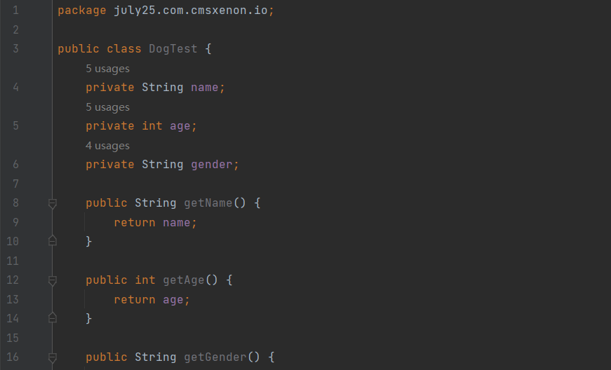

# 一、JAVA介绍

## 1.1什么是java

java是一门强类型的高级编程语言, java语言是Microsystems sun(简称sun公司,在2009年被oracle公司)在1995年推出的编程语言。

java语言它应用在物联网, 云计算,大数据,银行业, 电商购物,OA,ERP, CMS,BBS等等。

java语言自从1995年出现以来, 到今天为止,已经过去27个念头,版本更新迭代(java18), 它是一门老牌的编程语言,依然稳居世界编程语言的前三甲, 现在围绕java语言,已经形成了一个生态圈, java不仅仅是一门语言,一门技术, 而是一个标准,一个平台。

java语言编写的程序可以在windows操作系统,mac os操作系统, linux操作系统等等都可以运行。

java语言之父是詹姆斯.高斯林,原来在IBM公司任职,联合几位小伙伴开发了java语言。

## 1.2 java语言的特点

- 简单性: 

  1. java语言的语法风格符合自然逻辑, 学习起来简单。
  2. java语言自带内存管理机制(GC垃圾回收),会自动回收java中不用的数据,释放内存空间(很少出现内存溢出问题)。

- 面向对象性:

  其他的编程语言

  1. 面向机器(计算机或者硬件设备)编程:  根据硬件的特点进行编程(嵌入式编程),比如: 网卡驱动程序。

  2. 面向过程(指的C,C++):  指的开发程序时,分析的程序的实现过程,而不是关注程序是"谁"实现的。

     比如: 公司人员(早期)要出差: 1. 预定机票   2. 预定酒店  。

     优点:  执行效率高(直接分析的程序的实现过程)；

     缺点: 代码不能复用(重复使用)。

     小结: 直接通过过程,完成程序的功能.,比如:  通过预定机票, 预定酒店完成出差功能。

  3. 面向对象(指的java语言): 指的开发程序时, 分析不是程序的实现过程,而是重点关注该程序是"谁"完成的。

     比如: 公司人员(稳定)要出差:  由公司的**行政人员**负责出差的相关事宜。

     优点: 代码可以复用；

     缺点: 执行效率相对面向过程而言比较低。

     小结: 指的通过对象实现功能. 比如:  出差功能需要行政人员(面向对象)完成的。

- 编译性和解释性

  - 编译性:

    指的高级语言编写的程序在运行前,先编译成计算机识别的代码,这个过程称之为编译

    高级语言编写程序----------->-高级语言 编译   二进制---------------------->计算机运行

    运行特点:

    把程序一次性全部编译成二进制, 在计算机运行.

  - 解释性

    指的客户端脚本语言(比如: html, css, javascript),可以直接在客户端运行,不需要编译。

    运行特点:

    通过客户端运行解释性语言的程序时 , 解释一行, 运行一行。

- 跨平台性:

  java语言编写的程序可以运行在任意平台(指的操作系统)。

- 开源性:

  java语言是免费使用的。

## 1.3 java的三大技术平台

Java SE (Java Platform Standard Edition)：Java标准平台，所有的项目都需要JavaSE的支持，包括JavaEE和JavaME。

JavaEE (Java Platform Enterprise Edition)：java企业版，以企业为环境而开发应用程序的解决方案

# 对象流

# 序列化

## 1.1概念

对象序列化就是把对象写入到输出流中，用来存储或者传输。

反序列化就是从输入流中读取对象。

具体描述：把一个引用类型，拆分成最小的单位byte，以便今后数据字节流的形式存储在磁盘中或者是通过网络协议发送另一方。

它是数据存储和发送的一种重要技术。

## 1.2 使用方法

已定义好一个Dog类型如下图：

然后在测试类中创建一个Doge对象

~~~~java
//创建DogTest对象
DogTest doge = new DogTest("xiaohei",2,"公");
~~~~

接着定位目标文件位置，使序列化后的对象输出在该文件位置

~~~java
//目标文件位置，序列化后对象输出在该文件位置
File file = new File("C:\\Users\\gg\\Desktop\\DogeTest01.data");
~~~

再就是创建OutputStream文件输出流

~~~java
 //创建OutputStream文件输出流
 OutputStream out = new FileOutputStream(file);
 ObjectOutputStream oos = new ObjectOutputStream(out);
 //文件输出方法
 oos.writeObject(doge);
 oos.close();
~~~

全部代码

# X、进程

## 1.1 进程概念

程序是指令和数据的有序集合，其本身没有任何运行的含义，是一个静态的概念。

而进程 Process，就是一个应用程序在运行期间向系统所申请的资源（硬件、软件）的总和，是程序在处理机上的一次执行过程，它是一个动态的概念。

进程是一个具有一定独立功能的程序，是一个实体，每一个进程都有它自己的地址空间。

进程是一个应用程序在运行期间，它所申请的资源(软件、硬件)的总和，它是当前应用程序所“独占”的内存中划定的一块区域。

当一个应用程序功能足够复杂时，它可能会由多个进程组成，每一个进程都会承担或者提供相应的某一项功能。

进程的状态有：就绪、运行、阻塞。

## 1.2 线程概念

线程Thread ，“是一个轻量级的进程”。它实际上是在进程基础之上的进一步划分，一个进程启动之后，里面的若干程序又可以划分成若干个线程。

线程又是进程的一个执行路径，共享一个内存空间，线程之间可以自由切换，并发执行，一个进程最少有一个线程。

一个线程如果想要运算，必须先争抢到CPU的时间片，才有机会让CPU来计算程序中指定的逻辑，并且由调度器来决定哪个线程什么时候来执行CPU运算。

## 1.3 线程的实现方法

